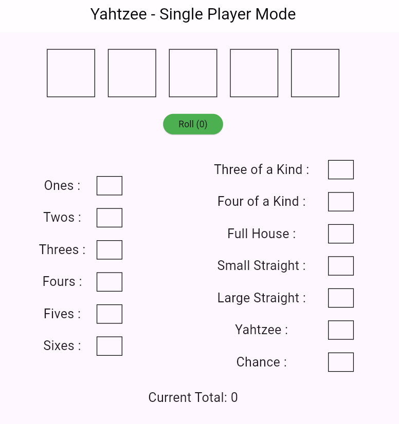
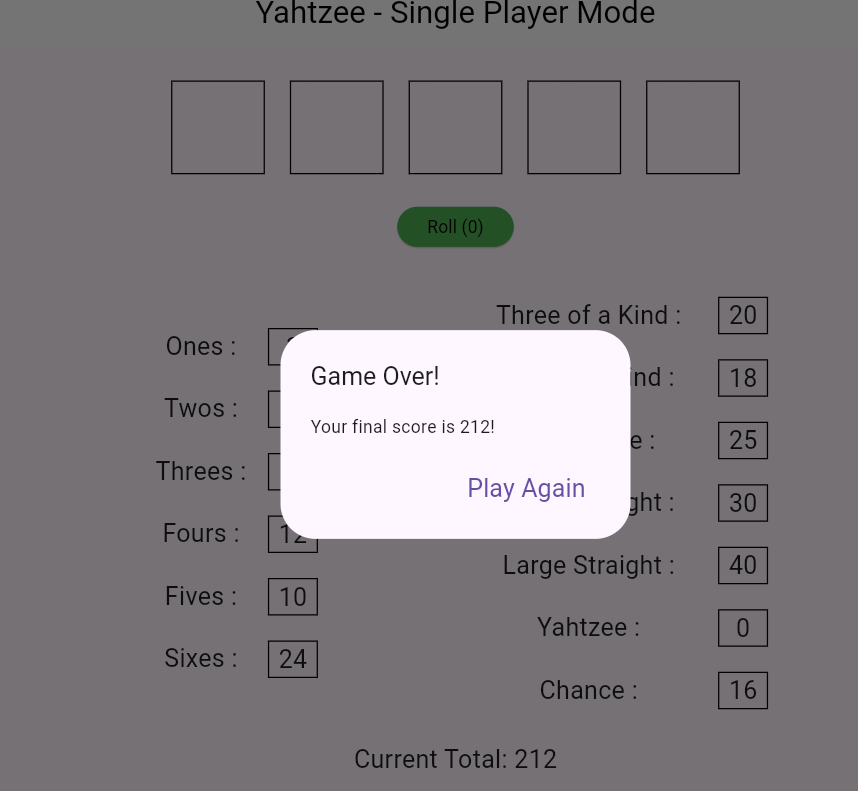

# Yahtzee Game

This is a Yahtzee game developed using Flutter.

## Getting Started

These instructions will get you a copy of the project up and running on your local machine for development and testing purposes.

### Prerequisites

What things you need to install the software and how to install them:

- Flutter SDK
- Dart SDK
- An IDE like VS Code or Android Studio

### Installation

1. Clone the repo
`git clone https://github.com/Roger9876/yahtzee-game.git`

2. Install Flutter packages
`flutter pub get`

3. Run the app
`flutter run`

## How to Play Yahtzee-Single Player Mode

Yahtzee is a classic dice game where the objective is to score the most points by rolling five dice to make specific combinations. Here's a step-by-step guide to playing a simple single-player game of Yahtzee.

## Game Setup

1. **Components To Look At:**
   - 5 dice (We have 5 empty boxes at the top which represents each dice and it will respective value when rolled)
   - Roll button (You can roll upto 3 times for a single turn, roll counter is also provided)
   - A scorecard (You can see scorecard below with each option having it's own scorebox)
   - Current Total which counts the total score and displays as game progress

        

2. **Scorecard Sections:**
   The scorecard is divided into two sections: the Upper Section and the Lower Section.

   **Left Section:**
   - Ones
   - Twos
   - Threes
   - Fours
   - Fives
   - Sixes

   **Right Section:**
   - Three of a Kind
   - Four of a Kind
   - Full House
   - Small Straight
   - Large Straight
   - Yahtzee (five of a kind)
   - Chance

## Game Play

### Step 1: Rolling the Dice

1. **Roll the Dice:**
   - On each turn, you roll all five dice up to three times to achieve the highest-scoring combination.

2. **Choosing Dice to Keep:**
   - After the first roll, decide which dice you want to keep (if any) and which you want to re-roll. To do this select the boxes to keep(which will turn red on selection) and roll again.
   - Select the dice to keep and re-roll the remaining dice. You can do this two more times (for a total of three rolls per turn).

3. **Final Dice Combination:**
   - After the third roll (or sooner if you're satisfied with your combination), you must choose a scoring category on your scorecard to apply your dice combination.

### Step 2: Scoring

1. **Left Section Scoring:**
   - Add up the dice that match the category. For example, if you place your dice in the "Fours" category, you score the sum of all dice showing the number 4.

2. **Right Section Scoring:**
   - **Three of a Kind:** If you have at least three dice showing the same number, score the total of all five dice.
   - **Four of a Kind:** If you have at least four dice showing the same number, score the total of all five dice.
   - **Full House:** If you have three of one number and two of another, score 25 points.
   - **Small Straight:** If you have four consecutive numbers (e.g., 1-2-3-4), score 30 points.
   - **Large Straight:** If you have five consecutive numbers (e.g., 1-2-3-4-5), score 40 points.
   - **Yahtzee:** If all five dice show the same number, score 50 points.
   - **Chance:** Score the total of all five dice (used when you can't fit your roll into another category).

3. **Filling the Scorecard:**
   - Click on the scorebox in which you want to add the score.
   - Each category on the scorecard can only be used once, so choose wisely.
   - If you cannot place your dice in any category, you must click on the unused categories and it will be filled as zero if results are not applicable to that category.

### Step 3: Ending the Game

1. **Complete the Scorecard:**
   - The game ends once all categories on the scorecard are filled.

2. **Calculating the Total Score:**
   - Your total score will automatically be shown once you fill all the score boxes.
   

3. **Winning:**
   - As a single-player game, the objective is to beat your highest score. Try to improve your score with each game!

### Example Turn

1. **First Roll:**
   - You roll: 2, 3, 3, 4, 6
   - You decide to keep the two 3s and re-roll the 2, 4, and 6.

2. **Second Roll:**
   - You roll: 3, 5, 3
   - Now you have three 3s, a 5, and a 3. You decide to keep all the 3s and re-roll the 5.

3. **Third Roll:**
   - You roll: 3
   - Now you have four 3s and a 5. You can choose to place this in the "Four of a Kind" category and score the total of all dice: 3+3+3+3+5 = 17 points.

4. **Mark the Score:**
   - You mark 17 points in the "Four of a Kind" category on your scorecard.

---

By following these instructions, you can enjoy a game of Yahtzee on your own, aiming to beat your personal best score each time you play!

## Contact

Raviraj Khopade - <rmkhopade21@gmail.com>
